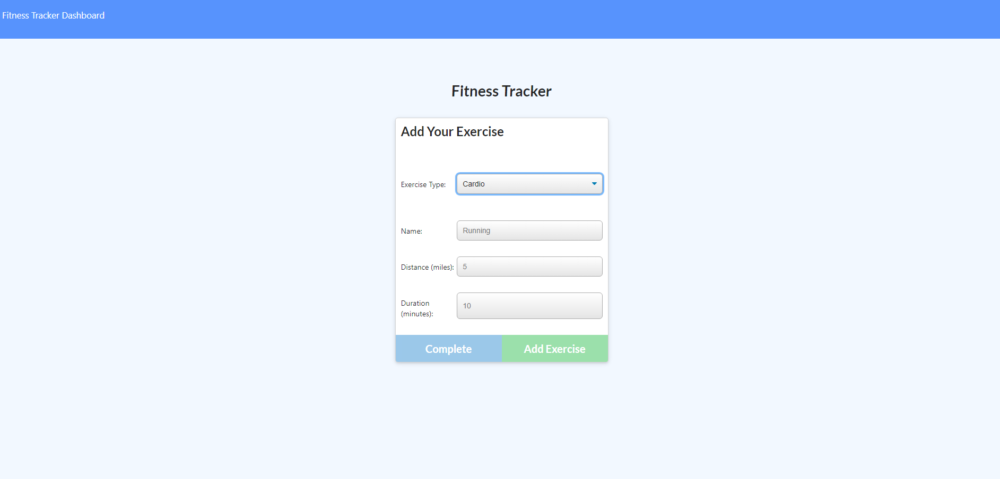

# Workout Tracker
​

## General-Info
​
General description here
​
This project utilizes a full MERN stack in order to CRUD data and display it realtime on visualizations. 
- Mongoose
- Express
- Node.js
- MongoDB
- Morgan
- Javascript
​
​
Landing page 
​

​

​
## Deployment
​
Download the repository
​
- Copy the repo
- Install all dependencies
- To run locally visit localhost:3000
- You can also use the heroku-link
- Deployed link: 

https://pacific-refuge-40772.herokuapp.com/
​
## Code Overview
​
- This application uses Mongodb to store workout information. It attaches a date to the workouts and combines them into a total to track progress
​
​
## Authors
​
- Gavin Murphy
​
## License
​
- Open Source